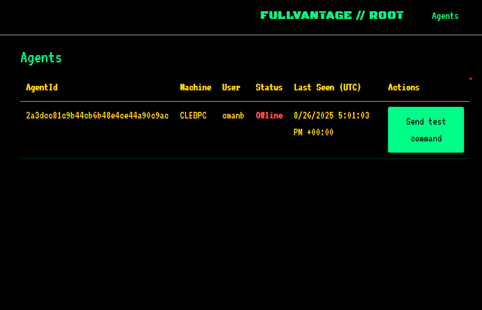

# FullVANTAGE (Virtual Administration & Network Tool for Access, Governance, and Execution)

An experimental, work in progress RAT (Remote Administration Tool) that is being developed and maintained for fun

<p align="center">
  
</p>

## Principles

- **Experimentation-first**
  - This repo is a sandbox for exploring distributed administration patterns, agent coordination, UI/UX for operator consoles, and real-time messaging.
- **Transparency over stealth**
  - The design prioritizes clarity and maintainability over evasion. It is not built for clandestine use.
- **Education and tinkering**
  - Intended for learning, prototyping, and hobbyist systems programming/networking. Not production-hardened.
- **Ethics & scope**
  - Only use on systems you own or have explicit authorization to test. The authors are not responsible for misuse.

## Project Layout

```
FullVANTAGE/
├─ builder/                 # Packaging/build utilities
│  └─ FullVantage.Builder/
├─ client/                  # Windows agent (headless/background client)
│  └─ FullVantage.Agent/
├─ server/                  # ASP.NET Core server + web UI (Blazor)
│  └─ FullVantage.Server/
├─ shared/                  # Shared contracts/models across client & server
│  └─ FullVantage.Shared/
└─ ex.png                   # Screenshot used in this README
```

## How it Works (High-level)

- **Server (`server/FullVantage.Server/`)**
  - Hosts a web UI (Blazor) and HTTP APIs for agent registration, heartbeats, and command dispatch.
  - Persists simple in-memory state (ephemeral during development) and exposes an overview of agents/status.
- **Agent (`client/FullVantage.Agent/`)**
  - A Windows .NET client that periodically checks in with the server, shares metadata (Machine, User, Status), and can accept commands.
- **Shared (`shared/FullVantage.Shared/`)**
  - DTOs and enums to keep server and agent in sync (e.g., `AgentInfo`, `AgentStatus`, command contracts).

## Features (WIP)

- **Agent registry**: View agents with status, last-seen, and basics like machine/user.
- **Command dispatch**: Send simple test commands to agents and view basic responses.
- **Theming & UI**: Hacker-inspired theme with terminal-style table and status coloring.

## Getting Started

### Prerequisites
- Windows 10/11
- .NET SDK 8.0+

### Clone
```
# Using HTTPS
git clone https://github.com/<your-user>/FullVANTAGE.git
cd FullVANTAGE
```

### Run the Server (Web UI + API)
```
dotnet run --project server/FullVantage.Server
```
- Default URL (as shown in console): `http://localhost:5118` (may vary).
- Open the browser and navigate to the site to view the dashboard.

### Run the Agent (Client)
In a separate terminal:
```
dotnet run --project client/FullVantage.Agent
```
- The agent will register with the server and begin periodic heartbeats.
- Confirm it appears on the Agents page.

### Build
```
dotnet build
```

## Usage Guide

1. **Start the server**, then **start one or more agents**.
2. Navigate to the **Agents** page in the web UI to see:
   - AgentId, Machine, User
   - Status (green/yellow-ish for active entries; Offline shows red)
   - Last Seen (UTC)
3. Use the **Send test command** action to verify connectivity.
4. Iterate: modify server or agent behavior, rebuild, and observe results.

## Configuration (Basics)

- Default URLs/ports are set by ASP.NET defaults. Adjust by editing `server/FullVantage.Server/appsettings.json` and/or launch settings if needed.
- For production-like scenarios, you would add:
  - Persistent storage for agents and command history
  - Authentication/authorization
  - TLS/HTTPS binding

## Roadmap Ideas (Non-binding)

- More command types (file ops, process info, system metrics)
- WebSocket/SignalR-based real-time channels
- Persistent backing store (SQLite/Postgres)
- Packaging the agent (MSI/self-contained)
- Multi-tenant/operator auth

## Disclaimer

This project is for educational and recreational purposes. Operate responsibly and legally. The maintainers disclaim all liability for misuse.
