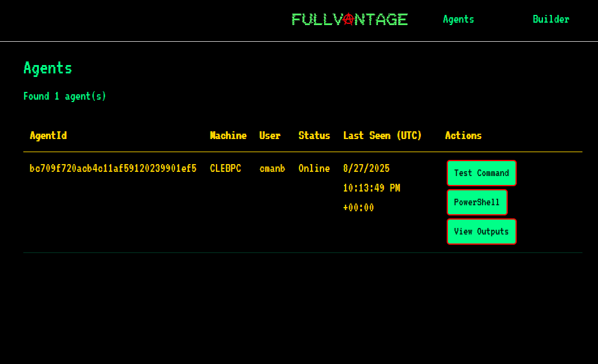
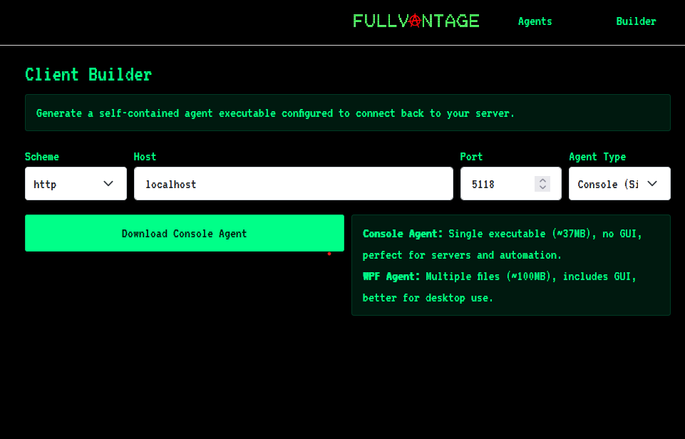

# FullVANTAGE 🚀

**Virtual Administration & Network Tool for Access, Governance, and Execution**

<p align="center">
  
</p>

<p align="center">
  <strong>An experimental, work-in-progress RAT (Remote Administration Tool) for learning distributed administration patterns and agent coordination</strong>
</p>

<p align="center">
  <strong>This project will always bee free and open source. I am also developing a premium, telegram based remote administration tool.</strong>
</p>

---

## ✨ Features

### 🔧 **Core Functionality**
- **Agent Registry & Management** - Real-time monitoring of connected agents with status tracking
- **Command Dispatch System** - Execute PowerShell commands remotely across multiple agents
- **Real-time Communication** - SignalR-based real-time updates and agent coordination
- **Multi-Agent Support** - Manage and monitor multiple Windows agents simultaneously

### 🖥️ **Agent Capabilities**
- **System Information Gathering** - OS version, machine name, user context, disk information
- **PowerShell Execution** - Remote command execution with configurable timeouts
- **Status Monitoring** - Real-time heartbeat monitoring and offline detection
- **Cross-Platform Support** - Windows .NET agents (Console and WPF variants)

### 🎛️ **Management Console**
- **Web-Based Dashboard** - Modern Blazor-based web interface
- **Agent Builder Tool** - Generate custom agent executables for deployment
- **Server Configuration** - Dynamic server binding and configuration management
- **Real-time Updates** - Live status updates without page refresh

### 🛡️ **Security & Control**
- **Command History** - Track and review all executed commands
- **Output Logging** - Capture and store command outputs for audit purposes
- **Timeout Controls** - Configurable command execution timeouts
- **Agent Authentication** - Secure agent registration and communication

---

## 🖼️ Screenshots

### Agent Management Dashboard
<p align="center">
  
</p>

### Agent Builder Tool
<p align="center">
  
</p>

### PowerShell Command Execution
<p align="center">
  
</p>

### File Management (Test Branch Only)
<p align="center">
  
</p>

---

## 🏗️ Architecture

```
FullVANTAGE/
├─ 🏗️  builder/                 # Agent packaging and build utilities
│  └─ FullVantage.Builder/     # Generates custom agent executables
├─ 💻  client/                  # Windows agent implementations
│  ├─ FullVantage.Agent/       # WPF-based agent with GUI
│  └─ FullVantage.Agent.Console/ # Console-based headless agent
├─ 🌐  server/                  # ASP.NET Core server + Blazor web UI
│  ├─ FullVantage.Server/      # Main server application
│  ├─ Components/               # Blazor UI components
│  ├─ Hubs/                     # SignalR communication hubs
│  └─ Services/                 # Business logic services
└─ 🔗  shared/                  # Shared contracts and models
   └─ FullVantage.Shared/      # Common DTOs and enums
```

---

## 🚀 Getting Started

### Prerequisites
- **Windows 10/11** (for agent deployment)
- **.NET SDK 8.0+** (for development and building)
- **Modern web browser** (for management console)

### Quick Start

1. **Clone the Repository**
   ```bash
   git clone https://github.com/<your-username>/FullVANTAGE.git
   cd FullVANTAGE
   ```

2. **Start the Server**
   ```bash
   dotnet run --project server/FullVantage.Server
   ```
   - Default URL: `http://localhost:5118`
   - Open your browser and navigate to the dashboard

3. **Deploy an Agent**
   - Use the **Builder** page to generate a custom agent executable
   - Download and run the agent on target Windows machines
   - Watch agents appear in real-time on the **Agents** page

4. **Execute Commands**
   - Select an agent from the dashboard
   - Use the **PowerShell** button to execute remote commands
   - Monitor outputs and command history

### Building from Source
```bash
# Build all projects
dotnet build

# Build specific components
dotnet build server/FullVantage.Server
dotnet build client/FullVantage.Agent
dotnet build client/FullVantage.Agent.Console
```

---

## 📋 Usage Guide

### **Agent Management**
1. **Monitor Status** - View real-time agent status (Online/Offline)
2. **System Information** - Access machine details, OS version, and disk information
3. **User Context** - Track which user context each agent is running under

### **Command Execution**
1. **PowerShell Commands** - Execute any PowerShell script or command
2. **Timeout Configuration** - Set execution timeouts (10-300 seconds)
3. **Output Capture** - Capture stdout/stderr in real-time
4. **Command History** - Review all executed commands and their outputs

### **Agent Builder**
1. **Custom Configuration** - Set target server host, port, and scheme
2. **Agent Type Selection** - Choose between Console (single file) or WPF (multiple files)
3. **Instant Download** - Generate and download custom agent executables

### **File Management** (Test Branch Only)
1. **File Browser** - Navigate remote file systems with a familiar tree view interface
2. **File Transfer** - Upload and download files between local and remote systems
3. **File Operations** - Copy, move, delete, and rename remote files and directories
4. **Transfer Monitoring** - Track file transfer progress and status in real-time

### **Server Configuration**
1. **Dynamic Binding** - Configure server URLs without code changes
2. **Port Management** - Adjust server ports for different deployment scenarios
3. **Scheme Selection** - Switch between HTTP and HTTPS protocols

---

## 🔮 Planned Features

### **Phase 1: Enhanced Commanding**
- [x] **File Operations** - Upload, download, and manage remote files
- [ ] **Process Management** - Start, stop, and monitor remote processes
- [ ] **Service Control** - Manage Windows services remotely
- [ ] **Registry Operations** - Read and modify Windows registry entries

### **Phase 2: Advanced Monitoring**
- [ ] **System Metrics** - CPU, memory, network, and disk performance monitoring
- [ ] **Event Logging** - Real-time Windows event log monitoring
- [ ] **Performance Counters** - Custom performance metric collection
- [ ] **Alert System** - Configurable alerts for system events

### **Phase 3: Security & Compliance**
- [ ] **Authentication System** - Multi-factor authentication for operators
- [ ] **Role-Based Access Control** - Granular permissions and access management
- [ ] **Audit Logging** - Comprehensive audit trail for compliance
- [ ] **Encryption** - End-to-end encryption for sensitive communications

### **Phase 4: Enterprise Features**
- [ ] **Multi-Tenant Support** - Isolated environments for different organizations
- [ ] **Persistent Storage** - SQL Server/PostgreSQL backend for scalability
- [ ] **API Integration** - RESTful APIs for third-party integrations
- [ ] **Deployment Automation** - MSI packages and automated deployment scripts

### **Phase 5: Advanced Capabilities**
- [ ] **Cross-Platform Agents** - Linux and macOS agent support
- [ ] **Mobile Management** - Mobile app for remote management
- [ ] **Machine Learning** - Anomaly detection and predictive analytics
- [ ] **Integration Hub** - Connect with existing IT management tools

---

## ⚙️ Configuration

### **Server Settings**
```json
{
  "ServerConfig": {
    "Scheme": "http",
    "Host": "localhost",
    "Port": 5118,
    "AgentTimeout": 300
  }
}
```

### **Agent Configuration**
- **Heartbeat Interval**: Configurable check-in frequency
- **Command Timeout**: Maximum execution time for remote commands
- **Logging Level**: Detailed logging for debugging and audit purposes

### **Network Configuration**
- **Firewall Rules**: Configure Windows Firewall for agent communication
- **Proxy Support**: HTTP proxy configuration for enterprise networks
- **SSL/TLS**: Secure communication with certificate management

---

## 🛠️ Development

### **Technology Stack**
- **Backend**: ASP.NET Core 8.0, SignalR, Blazor Server
- **Frontend**: Blazor Components, Bootstrap 5, Custom CSS
- **Agents**: .NET 8.0, WPF, Console Applications
- **Communication**: HTTP/HTTPS, WebSockets, JSON

### **Development Setup**
1. **IDE**: Visual Studio 2022 or VS Code with C# extensions
2. **Debugging**: Attach to running processes for agent debugging
3. **Hot Reload**: Blazor hot reload for rapid UI development
4. **Testing**: Unit tests and integration testing framework

### **Contributing**
1. Fork the repository
2. Create a feature branch
3. Implement your changes
4. Add tests and documentation
5. Submit a pull request

---

## ⚠️ Important Notes

### **Educational Purpose**
This project is designed for **educational and recreational purposes only**. It serves as a learning platform for:
- Distributed systems architecture
- Real-time communication patterns
- Windows administration automation
- Modern web application development

### **Ethical Use**
- **Only use on systems you own or have explicit authorization to test**
- **Not intended for production environments**
- **Not designed for clandestine or unauthorized access**
- **Maintainers are not responsible for misuse**

### **Security Considerations**
- **Default configuration is not production-hardened**
- **No built-in authentication in current version**
- **Communications are not encrypted by default**
- **Intended for controlled, isolated testing environments**

---

## 📄 License

This project is provided as-is for educational purposes. Please use responsibly and in accordance with applicable laws and regulations.

---

## 🤝 Support & Community

- **Issues**: Report bugs and feature requests via GitHub Issues
- **Discussions**: Join community discussions for questions and ideas
- **Contributions**: Welcome contributions from the community
- **Documentation**: Help improve documentation and examples
